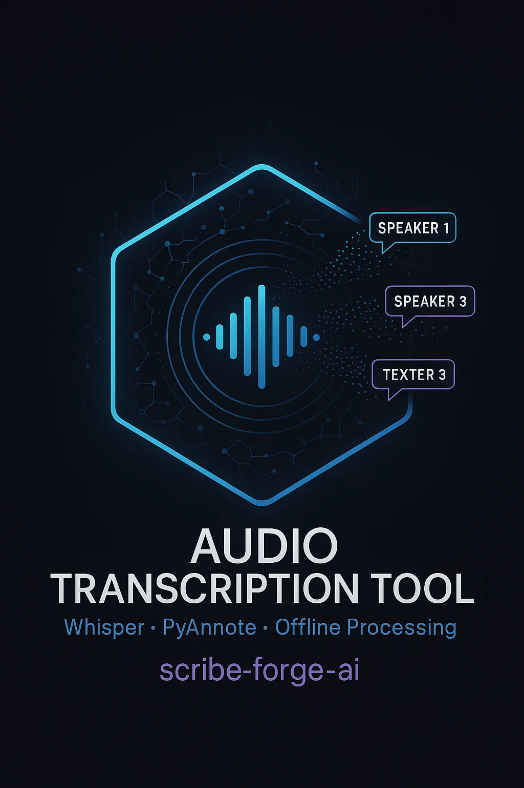

## ☕ Support This Project

Support my work: [coff.ee/theseraphim](https://coff.ee/theseraphim)

# Audio Transcription Tool

Complete system for audio transcription with speaker diarization, using AI models that work entirely offline. Optimized for Windows with intelligent installation and automatic compatibility handling.

## Features

- **Accurate transcription** using OpenAI Whisper models
- **Intelligent speaker diarization** with automatic method selection:
  - Python 3.12+: Resemblyzer (no compilation issues, no tokens needed)
  - Python 3.11-: pyannote.audio (traditional method)
- **Precise timestamps** for every segment and word
- **Automatic audio cleaning** to improve quality
- **Support for multiple formats** (M4A, WAV, MP3, FLAC, etc.)
- **Multiple output types** (JSON, TXT, Markdown)
- **Offline operation** - no external APIs required
- **Optimized GPU acceleration** with CUDA 12.4 support
- **Local model caching** for offline usage
- **Detailed logging** with precise timestamps
- **Zero-config installation** for most scenarios

## Installation (Windows)

### 🚀 One-Click Installation (Recommended)

**Run PowerShell as Administrator** and execute:

```powershell
# Full installation with all features
.\install.ps1

# With model downloads for offline usage
.\install.ps1 -DownloadModels -DownloadDiarizationModels -HuggingFaceToken "hf_your_token"

# CPU-only installation (no CUDA)
.\install.ps1 -NoGPU

# Skip speaker diarization if not needed
.\install.ps1 -SkipDiarization
```

**The installation script automatically:**
- ✅ Detects your Python version and chooses the best compatibility approach
- ✅ Installs optimized PyTorch with CUDA 12.4 for maximum GPU performance
- ✅ Handles all dependency conflicts and compilation issues
- ✅ Sets up speaker diarization without HuggingFace token hassles (Python 3.12+)
- ✅ Downloads models locally for offline usage (optional)
- ✅ Creates a ready-to-use virtual environment

### Installation Options

```powershell
# Installation script options
.\install.ps1 [OPTIONS]

Options:
  -SkipDependencies         # Skip system tools (Python, FFmpeg, etc.)
  -NoGPU                   # Force CPU-only PyTorch
  -DownloadModels          # Download Whisper models
  -DownloadDiarizationModels # Download speaker diarization models locally
  -SkipDiarization         # Skip speaker diarization setup
  -ForceNonAdmin           # Run without Administrator (limited functionality)
  -HuggingFaceToken        # Specify HF token for pyannote models
  -Help                    # Show detailed help
```

### Non-Interactive Quick Start (Windows PowerShell)

All configuration uses CLI switches and environment variables — no prompts.

```powershell
# 0) Optional: allow local scripts for this session only
Set-ExecutionPolicy -Scope Process -ExecutionPolicy Bypass -Force

# 1) Optional tokens (only needed for pyannote diarization)
$env:HF_TOKEN = "hf_xxx"      # or use HUGGINGFACE_HUB_TOKEN / HUGGING_FACE_HUB_TOKEN
$env:GITHUB_TOKEN = "ghp_xxx" # optional

# 2) Install (non-interactive)
.#\install.ps1 -ForceNonAdmin -DownloadModels -DownloadDiarizationModels -HuggingFaceToken $env:HF_TOKEN

# CPU-only pinned Torch (auto-detected if no NVIDIA)
.\install.ps1 -NoGPU

# 3) Run (Resemblyzer by default; no token required)
.\run.ps1 -Input ".\audio.ogg" -Output ".\out\audio.md" -Format md -ModelSize base -Device auto -Diarize -CreateOutputDir
```

### System Requirements

**Minimum:**
- Windows 10/11
- PowerShell 5.1+
- Administrator privileges (for installation)
- 4GB RAM
- 2GB disk space

**Recommended:**
- Windows 11
- 16GB RAM
- NVIDIA GPU with 6GB+ VRAM (automatically detected)
- 10GB free disk space

### Manual Installation (Advanced Users)

If you prefer manual control:

```powershell
# 1. Create virtual environment
python -m venv venv
venv\Scripts\Activate.ps1

# 2. Install dependencies
pip install -r requirements.txt

# 3. For GPU acceleration (optional)
pip install torch torchaudio --index-url https://download.pytorch.org/whl/cu124

# 4. For speaker diarization (Python 3.12+)
pip install resemblyzer scikit-learn

# 5. For speaker diarization (Python 3.11-)
pip install pyannote.audio
```

## Models Used

### Whisper (Transcription)
Whisper models are downloaded automatically on first use or with `-DownloadModels`:

| Model | Size | VRAM | Speed | Quality |
|-------|------|------|-------|---------|
| tiny    | 39 MB  | ~1GB | ~32x | Basic |
| base    | 74 MB  | ~1GB | ~16x | Good |
| small   | 244 MB | ~2GB | ~6x  | Very good |
| medium  | 769 MB | ~5GB | ~2x  | Excellent |
| large-v3| 1550 MB| ~10GB| ~1x  | Best |

### Speaker Diarization

**Resemblyzer** (Python 3.12+, default):
- **Advantages**: No compilation, no tokens needed, works immediately
- **Size**: ~50MB
- **Requirements**: None beyond installation script

**PyAnnote** (Python 3.11-, optional):
- **Model**: `pyannote/speaker-diarization-3.1`
- **Size**: ~300MB
- **Requirements**: HuggingFace token and model acceptance

## Usage

### Basic Examples

```bash
# Activate virtual environment first
venv\Scripts\Activate.ps1

# Simple transcription
python main.py input.m4a -o output --format txt

# With speaker diarization
python main.py input.m4a -o output --format md --diarize

# High quality with GPU acceleration
python main.py input.m4a -o output --format json --model-size large-v3 --clean-audio --diarize

# Force CPU usage
python main.py input.m4a -o output --format txt --device cpu
```

### Full Parameters

```bash
python main.py INPUT_FILE -o OUTPUT_PATH [OPTIONS]

Required arguments:
  INPUT_FILE                Input audio file
  -o, --output OUTPUT_PATH  Output path (without extension)

Options:
  --format {json,txt,md}    Output format (default: txt)
  --model-size {tiny,base,small,medium,large,large-v2,large-v3}
                            Whisper model size (default: base)
  --diarize                 Enable speaker diarization
  --language LANG           Audio language (auto-detect if not specified)
  --device {auto,cpu,cuda}  Processing device (default: auto)
  --download-models         Download models before processing
  --log-level {DEBUG,INFO,WARNING,ERROR}
                            Logging level (default: INFO)
  --clean-audio             Apply audio cleaning
```

### Practical Examples

```bash
# Italian meeting with multiple speakers
python main.py meeting.m4a -o meeting_transcript \
  --format md --diarize --language it --clean-audio

# English interview, JSON output for analysis
python main.py interview.wav -o interview_data \
  --format json --model-size medium --diarize

# Long podcast with best quality
python main.py podcast.mp3 -o podcast_transcript \
  --format txt --model-size large-v3 --log-level DEBUG
```

## Output Structure

### TXT Format
```
Audio Transcription
Generated: 2025-06-17 14:30:00
Language: Italian
Speakers detected: 2

==================================================

[00:00:05] SPEAKER_00: Buongiorno e benvenuti alla nostra riunione.
[00:00:12] SPEAKER_01: Grazie, sono felice di essere qui.
[00:00:18] SPEAKER_00: Iniziamo con il primo punto all'ordine del giorno.
```

### JSON Format
```json
{
  "metadata": {
    "created_at": "2025-06-17T14:30:00",
    "language": "Italian",
    "has_speakers": true,
    "total_segments": 45,
    "diarization_method": "Resemblyzer"
  },
  "transcription": {
    "text": "Full transcription text...",
    "language": "Italian",
    "segments": [
      {
        "id": 0,
        "start": 5.2,
        "end": 8.7,
        "text": "Buongiorno e benvenuti",
        "speaker": "SPEAKER_00",
        "words": [
          {
            "word": "Buongiorno",
            "start": 5.2,
            "end": 5.8,
            "probability": 0.95
          }
        ]
      }
    ]
  }
}
```

### Markdown Format
```markdown
# Audio Transcription

**Generated:** 2025-06-17 14:30:00  
**Language:** Italian  
**Speakers:** 2  
**Diarization:** Resemblyzer

---

## Transcription with Timestamps

### SPEAKER_00

**00:00:05**: Buongiorno e benvenuti alla nostra riunione.

**00:00:18**: Iniziamo con il primo punto all'ordine del giorno.

### SPEAKER_01

**00:00:12**: Grazie, sono felice di essere qui.
```

## Smart Installation Features

### Automatic Python Version Handling
The installation script detects your Python version and automatically chooses the best approach:

**Python 3.13+**: Uses Resemblyzer for speaker diarization (recommended)
- ✅ No compilation issues
- ✅ No HuggingFace tokens needed
- ✅ Works immediately after installation

**Python 3.11-3.12**: Offers both Resemblyzer and pyannote.audio options
- ✅ Fallback mechanisms for maximum compatibility
- ✅ Handles compilation issues automatically

### GPU Optimization
- **Automatic CUDA detection** and driver compatibility check
- **Optimized PyTorch** installation with CUDA 12.4 support
- **Eliminates Triton warnings** and performance issues
- **CPU fallback** for systems without compatible GPUs

### Local Model Caching
```powershell
# Download models for offline usage
.\install.ps1 -DownloadDiarizationModels -HuggingFaceToken "hf_your_token"
```
- Downloads pyannote models to local cache
- Enables completely offline operation
- Bypasses HuggingFace authentication during transcription
- Automatic cache setup and management

## Troubleshooting

### Installation Issues

**1. "Administrator privileges required"**
```
ERROR This script requires Administrator privileges!
```
**Solution**: Run PowerShell as Administrator or use:
```powershell
.\install.ps1 -ForceNonAdmin -SkipDependencies
```

**2. Python version compatibility**
```
WARNING Python 3.13 detected - using Resemblyzer for speaker diarization
```
**Solution**: This is normal! The script automatically uses the best method for your Python version.

**3. CUDA installation issues**
```
WARNING Failed to install CUDA toolkit
```
**Solution**: Use CPU-only mode:
```powershell
.\install.ps1 -NoGPU
```

### Runtime Issues

**1. Speaker diarization not working**
```
INFO No speaker diarization available
```
**Check**: Verify installation completed successfully:
```bash
python -c "import resemblyzer; print('Resemblyzer available')"
```

**2. GPU not detected**
```
INFO Using device: cpu
```
**Solution**: Check CUDA installation:
```bash
python -c "import torch; print(torch.cuda.is_available())"
```

**3. Model download issues**
```
WARNING Model download failed
```
**Solution**: Models download automatically on first use, or use:
```powershell
.\install.ps1 -DownloadModels
```

### Performance Optimization

**For long files (>1 hour):**
- Use `--model-size small` or `base`
- Avoid `--clean-audio` if not needed
- Consider using `--device cpu` for very long files

**For best quality:**
- Use `--model-size large-v3`
- Enable `--clean-audio`
- Ensure GPU acceleration: `--device cuda`

**For maximum speed:**
- Use `--model-size tiny`
- Disable diarization or use Resemblyzer method
- Skip audio cleaning

## Logging

The system uses detailed logging with timestamps:

```
[20250617-143000] INFO - Starting audio transcription process
[20250617-143001] INFO - Using device: cuda
[20250617-143001] INFO - Resemblyzer available - speaker diarization enabled
[20250617-143002] INFO - Processing audio file: meeting.m4a
[20250617-143005] INFO - Loaded audio: 1547.2s, 16000Hz
[20250617-143006] INFO - Loading Whisper model: large-v3
[20250617-143008] INFO - Starting transcription...
[20250617-143045] INFO - Detected language: Italian
[20250617-143046] INFO - Performing speaker diarization...
[20250617-143078] INFO - Diarization completed: 2 speakers detected
[20250617-143079] INFO - Saving output in md format...
[20250617-143080] INFO - ✅ Transcription completed with speaker diarization
```

## Supported Audio Formats

- **Input**: M4A, WAV, MP3, FLAC, OGG, WMA, AAC
- **Internal processing**: WAV 16kHz mono
- **Maximum duration**: Limited only by available memory

## Advanced Configuration

### Environment Variables
```powershell
# For offline pyannote usage (if downloaded locally)
$env:HF_HUB_OFFLINE = "1"

# Force CPU usage
$env:CUDA_VISIBLE_DEVICES = ""

# Custom cache directory
$env:TRANSFORMERS_CACHE = "D:\models\cache"
```

### Custom Diarization Settings
The system automatically chooses the best diarization method, but you can verify which is being used:

```bash
python -c "
import sys
sys.path.append('src')
from diarizer import Diarizer
print('Diarizer using optimal method for your Python version')
"
```

## License

This project uses:
- **Whisper**: MIT License (OpenAI)
- **Resemblyzer**: Apache 2.0 License
- **PyAnnote**: MIT License
- **Other dependencies**: Various open source licenses

See the LICENSE files of the individual dependencies for full details.

---

**🎯 Ready to transcribe? Run `.\install.ps1` as Administrator and you'll be set up in minutes!**
