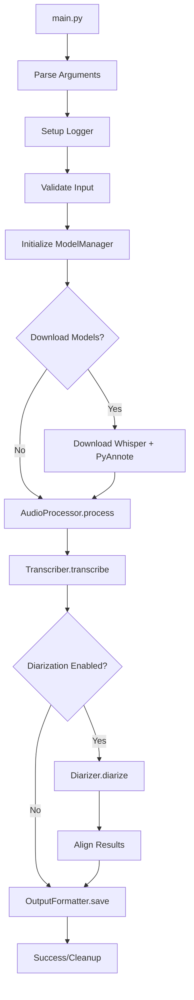

# Project Structure

```
audio-transcription-tool/
├── main.py                     # Main entry script
├── requirements.txt            # Python dependencies
├── setup.py                    # Installation script
├── install.sh                  # Automatic installation script
├── README.md                   # Main documentation
├── STRUCTURE.md                # This file
├── Dockerfile                  # Docker containerization
├── docker-compose.yml          # Docker Compose configuration
├── Makefile                    # Development automation tasks
├──
├── src/                        # Modular source code
│   ├── __init__.py             # Module initialization
│   ├── logger.py               # Logging system with timestamps
│   ├── audio_processor.py      # Audio processing and cleaning
│   ├── model_manager.py        # Model download and loading management
│   ├── transcriber.py          # Transcription with Whisper
│   ├── diarizer.py             # Speaker diarization with PyAnnote
│   └── output_formatter.py     # Output formatting (JSON/TXT/MD)
├──
├── examples/                   # Usage examples
│   ├── usage_examples.py       # Practical examples script
│   └── sample_files/           # Sample audio files (to add)
├──
├── models/                     # AI model directory (created automatically)
│   ├── whisper/                # Downloaded Whisper models
│   └── huggingface/            # HuggingFace model cache
├──
├── temp/                       # Temporary directory (created automatically)
├──
├── data/                       # Optional directory for input/output files
│   ├── input/                  # Input audio files
│   └── output/                 # Generated transcriptions
├──
└── docs/                       # Additional documentation
    ├── API.md                  # Internal API documentation
    ├── PERFORMANCE.md          # Performance optimization guide
    └── TROUBLESHOOTING.md      # Detailed troubleshooting
```

## Module Description

### Core (`src/`)

#### `main.py`
- **Purpose**: Main entry point of the application
- **Functions**:
  - Command-line argument parsing
  - Workflow orchestration
  - Global error handling
- **Dependencies**: All `src/` modules

#### `logger.py`
- **Purpose**: Consistent logging system
- **Features**:
  - Timestamp format `[yyyyMMdd-HHmmss]`
  - Configurable levels (DEBUG, INFO, WARNING, ERROR)
  - Console output with formatting
- **Pattern**: Singleton logger for consistency

#### `audio_processor.py`
- **Purpose**: Audio file processing and cleaning
- **Functions**:
  - Format conversion (M4A → WAV)
  - Audio cleaning (noise removal, normalization)
  - Audio filters (high-pass, wiener)
  - Temporary file management
- **Dependencies**: librosa, soundfile, scipy

#### `model_manager.py`
- **Purpose**: AI model management
- **Responsibilities**:
  - Automatic Whisper model download
  - HuggingFace model cache management
  - GPU/CPU optimization
  - Information on available models
- **Pattern**: Factory pattern for model creation

#### `transcriber.py`
- **Purpose**: Audio transcription to text
- **Features**:
  - Support for all Whisper models
  - Word and segment level timestamps
  - Automatic language detection
  - Standardized result formatting
- **Output**: Unified data structure with segments and metadata

#### `diarizer.py`
- **Purpose**: Speaker identification and separation
- **Functions**:
  - Diarization with PyAnnote
  - Alignment with transcription
  - Automatic speaker count detection
  - Timestamp integration
- **Algorithm**: Overlays diarization results with transcription segments

#### `output_formatter.py`
- **Purpose**: Generate output in multiple formats
- **Supported formats**:
  - **JSON**: Complete structure with metadata
  - **TXT**: Readable format with timestamps
  - **MD**: Markdown formatted for documentation
- **Features**: Customizable templates for each format

### Examples (`examples/`)

#### `usage_examples.py`
- **Purpose**: Feature demonstration
- **Included examples**:
  - Basic transcription
  - With speaker diarization
  - High quality with audio cleaning
  - Fast transcription
  - Specific language configurations

### Installation and Deploy

#### `install.sh`
- **Purpose**: Multi-platform automated installation
- **Support**: Linux, macOS, partial Windows
- **Functions**:
  - Automatic OS detection
  - System dependency installation
  - Virtual environment creation
  - Base model download
  - HuggingFace configuration

#### `Dockerfile` + `docker-compose.yml`
- **Purpose**: Containerization for deployment
- **Features**:
  - Optimized image with pre-installed dependencies
  - GPU support via NVIDIA Docker
  - Persistent volumes for models
  - Environment variable configuration

## Execution Flow



## Design Patterns Used

### 1. **Dependency Injection**
- Each module receives dependencies via constructor
- Logger injected into all components
- ModelManager shared between Transcriber and Diarizer

### 2. **Factory Pattern**
- ModelManager as factory for AI models
- OutputFormatter factory for different formats

### 3. **Strategy Pattern**
- Different output formats implement the same interface
- Optional audio cleaning via strategy

### 4. **Template Method**
- Main flow in `main()` with customizable steps
- Extendable processing pipeline

## Extensibility

### Add a New Output Format
1. Extend `OutputFormatter._save_FORMAT()`
2. Add the choice in argparse
3. Update the documentation

### Add a New Model
1. Implement in `ModelManager`
2. Add support in `Transcriber`
3. Update the list of available models

### Add Audio Processing
1. Extend `AudioProcessor._clean_audio()`
2. Add configurable parameters
3. Document the effect on quality

## Critical Dependencies

### Core ML
- **whisper**: Audio-to-text transcription
- **pyannote.audio**: Speaker diarization
- **torch**: ML backend for both

### Audio Processing
- **librosa**: Audio loading and manipulation
- **soundfile**: Audio file I/O
- **scipy**: Digital filters and signal processing

### Utilities
- **numpy**: Numerical array operations
- **pandas**: Data manipulation (optional)
- **pathlib**: Cross-platform path handling

## Environment Configuration

### Environment Variables
```bash
# HuggingFace token for diarization
export HUGGINGFACE_HUB_TOKEN="your_token_here"

# Force CPU usage (disable GPU)
export CUDA_VISIBLE_DEVICES=""

# Custom cache directories
export WHISPER_CACHE_DIR="/path/to/whisper/cache"
export HF_HOME="/path/to/huggingface/cache"
```

### Configuration Files
- `requirements.txt`: Precise Python dependencies
- `setup.py`: Package installation
- `Dockerfile`: Containerized environment
- `.gitignore`: Versioning exclusions

## Performance and Optimization

### Memory Usage
- **tiny**: ~1GB RAM
- **base**: ~2GB RAM
- **small**: ~4GB RAM
- **medium**: ~8GB RAM
- **large-v3**: ~16GB RAM

### GPU Usage
- Whisper supports CUDA for acceleration
- PyAnnote requires GPU for optimal performance
- Automatic fallback to CPU if GPU is unavailable

### Optimizations
- Model caching to avoid re-downloading
- Batch processing for multiple files
- Optimized memory handling for long files
